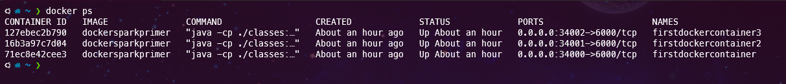
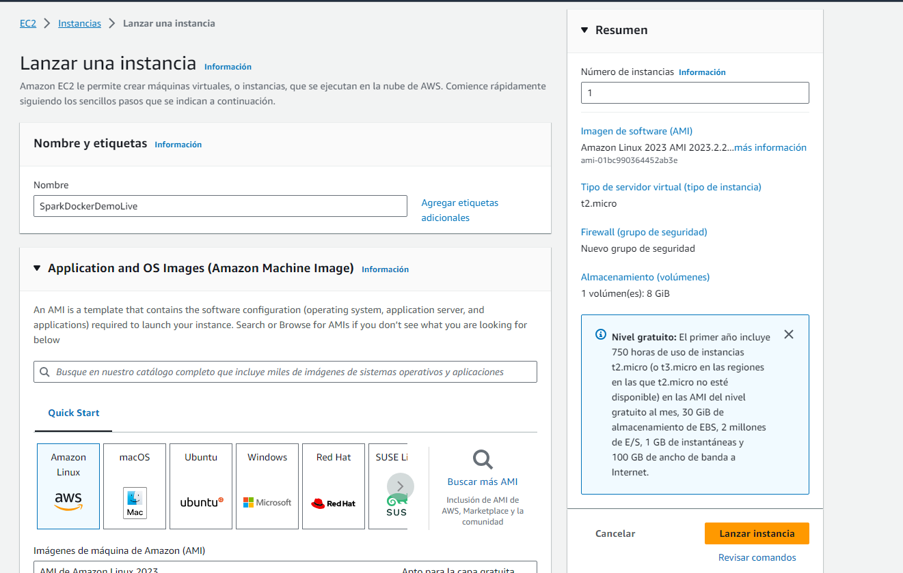
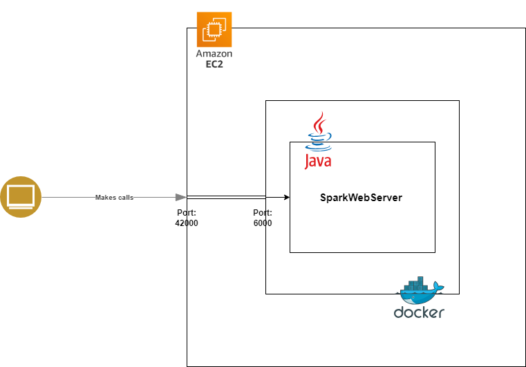

# TALLER DE INTRODUCCIÓN A VIRTUALIZACIÓN Y PROG. DISTRIBUIDA

## Conceptos

### Docker
Docker es una tecnología de creación de contenedores que permite la creación y el uso de contenedores de Linux®. Con docker, puede usar los contenedores como máquinas virtuales extremadamente livianas y modulares.

### AWS
AWS o Amazon Web Services es un proveedor de servicios en la nube, ofrece servicios de almacenamiento, de recursos de computación, de aplicaciones, bases de datos, etc.

### EC2
Amazon Elastic Compute Cloud (EC2) es un servicio de cómputo en la nube de AWS que permite a los usuarios lanzar y administrar servidores virtuales escalables, conocidos como instancias, en la nube. Estas instancias pueden ejecutar una variedad de sistemas operativos y aplicaciones, y se utilizan para alojar aplicaciones, sitios web y otros recursos informáticos en la nube.

## Pre-requisitos

Debe tener instalado lo siguiente:

* [GIT](https://git-scm.com/book/es/v2/Inicio---Sobre-el-Control-de-Versiones-Instalación-de-Git)
* [JAVA 8](https://www.java.com/es/download/)
* [MAVEN](https://maven.apache.org)
* [DOCKER](https://www.docker.com/)
* **DOCKER-COMPOSE** - Viene incluido en Docker Desktop, sin embargo si no lo tiene, puede ver como instalarlo [AQUÍ](https://docs.docker.com/compose/install/).

## Compilación

* Para hacer una instalación limpia de las dependencias y plugins con maven

        mvn clean install

* Para compilar el código fuente únicamente.

        mvn compile

## Ejecución

**JAVA Linux**

        java -cp target/classes:target/dependency/* co.edu.escuelaing.sparkdockerdemolive.SparkWebServer

**JAVA Windows**

        java -cp target/classes;target/dependency/* co.edu.escuelaing.sparkdockerdemolive.SparkWebServer

Al acceder a la url http://localhost:4567/hello debería ver el siguiente mensaje.

### Ejecucion en Docker

**Docker**

La definición para la imagen donde se construye a partir de un [Dockerfile](Dockerfile). Un Dockerfile es un archivo de texto que contiene una serie de instrucciones para construir una imagen de Docker. Una vez que se construye la imagen, se puede utilizar para desplegar el servicio varias veces.
Como en este archivo se definió el puerto 6000 como variable de entorno el servicio se desplegara por el puerto 6000 dentro de cada contenedor que se construya a partir de la imagen.

* Construir la imagen.

        docker build --tag dockersparkprimer.

* Construir el contenedor, encender el contenedor y mapear el puerto 6000 del contenedor con el 34000 del equipo.

        docker run -d -p 34000:6000 --name firstdockercontainer dockersparkprimer

Al acceder a la url http://localhost:34000/hello debería ver el siguiente mensaje.

Podemos usar la imagen para construir multiples contenedores y desplegar los servicios en diferentes puertos.

    docker run -d -p 34001:6000 --name firstdockercontainer dockersparkprimer
    docker run -d -p 34002:6000 --name firstdockercontainer dockersparkprimer

Ejecutando `Docker ps` debería ver algo similar a esto.

**Docker Compose**

        docker-compose build
        docker-compose up -d

En el [docker-compose.yml](docker-compose.yml) usamos el Dockerfile para construir una imagen y un contenedor con el tag web para el servicio de SparkWebServer junto con una imagen mongodb y contenedor llamado db.

Debería ver lo siguiente:

## Subir la imagen a DockerHub

1. Si no la tiene crear una cuenta de dockerhub.
2. Crear un repositorio llamado dockersparkprimer.
3. Crear una referencia a la imagen con el nombre del repositorio a donde se subirá.

        docker tag dockersparkprimer ricar8o/firstsprkwebapprepo

4. Revisar las imagenes y sus referencias.

        docker images

5. Autenticarse con la cuenta de Dockerhub.

        docker login

6. Enviar la imagen al repositorio en DockerHub.

        docker push ricar8o/firstsprkwebapprepo:latest

7. Al subirse debería verse la imagen cargada en la sección de tags.

    

## Desplegar un contenedor en AWS

Para este ejercicio se usara el servicio EC2 de AWS para crear una instancia, acceder a ella y desplegar un contenedor con la imagen que hemos construido.

### Instancia

A continuación se muestran los pasos para crear y acceder a una instancia EC2 de AWS.

1. Acceder a la consola de AWS.

    

2. Crear una instancia EC2 (Se recomienda una instancia Amazon Linux y t2 micro para el ejercicio).

    

*  Importante! crear un par de llaves para acceder a la instancia.

    

3. Una vez creada, accedemos a la instancia con el siguiente comando:

        ssh -i "sparkDockerDemoLive.pem" ec2-user@ec2-54-226-207-197.compute-1.amazonaws.com

* Al acceder a la consola se ve lo siguiente:

    

###  Desplegando el contenedor en la instancia con docker

1. Instalar Docker.

        sudo yum update -y
        sudo yum install docker

2. Iniciar servicio de Docker.

        sudo service docker start

3. Configurar usuario en el grupo de docker para no tener que ingresar "sudo" cada vez que invoca un comando.

        sudo usermod -a -G docker ec2-user

4. Ejecutar el siguiente comando para desplegar un contenedor a partir de la imagen subida en dockerhub.

        docker run -d -p 42000:6000 --name firstdockerimageaws ricar8o/firstsprkwebapprepo

    

5. Se agrega el puerto en las reglas de entrada del security group de la instancia.

    

6. Entrar desde el navegador al recurso con el DNS publico de la instancia y el puerto que se abrió en el paso anterior.

    

### Explicación Arquitectura

- Primero se creo una aplicación en java usando spark para desplegar una ruta llamada `hello` al ejecutar la aplicación.
- Después se definió un Dockerfile para crear una imagen y ejecutar la aplicación java dentro de un contenedor en Docker y usando el puerto 6000 que fue definido como variable de entorno dentro del Dockerfile.
- Después se creo una instancia donde se uso la imagen para desplegar un contenedor dentro de la instancia con un tunel entre el puerto 42000 de la instancia y el 6000 del contendedor para que todo el trafico que pase por el puerto 42000 sea dirigido al 6000 del contenedor.

    

## Autor

Andrés Ricardo Martínez Díaz - [Ricar8o](https://github.com/Ricar8o)
